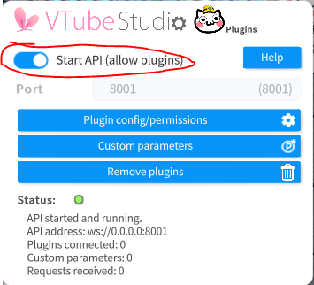
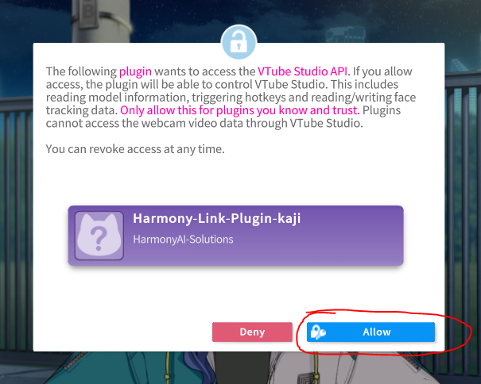
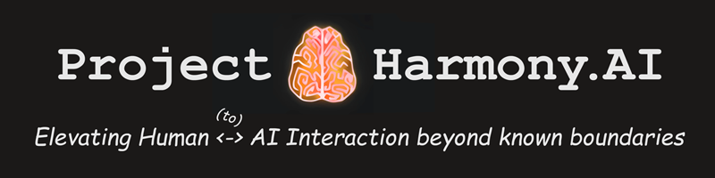

<h1 align="center"> Project Harmony.AI - VTube Studio Plugin </h1>

  

**Harmony.AI VTube Studio Plugin** is an AI powered voice assistant capable of controlling a VTuber model
in VTube Studio, in combination with Harmony.AI's [Harmony Link AI Middleware](https://project-harmony.ai/technology/). 
It's a Fork of [JarikDem-Bot/ai-waifu](https://github.com/JarikDem-Bot/ai-waifu).

This project is meant to create an engaging experience combining the charm of anime characters brought to life with cutting-edge technologies.
It allows you to interact with desired character in real-time without powerful hardware.

By forking and adapting the initial repo to work with our Harmony Link Middleware, we allow for fully local setup without cloud services,
as well as participating in newest developments in AI Technology for creating realistic AI Characters.

## Features

- 🎤 **Voice Interaction:** Speak to your AI character and get instant (almost) responses.
    - OpenAI Whisper is supported locally through [Harmony Speech Engine](https://github.com/harmony-ai-solutions/harmony-speech-engine)
    - Or using OpenAIs Cloud API.
    - Other Services for better Latency and Comprehension by the AI will be added to Harmony Speech Engine soon.

- 🤖 **AI Chatbot Integration:** Conversations are powered by an AI chatbot, ensuring engaging and dynamic interactions.
    - OpenAI's *'gpt-3.5-turbo'* or any other available model.
    - Kajiwoto AI Characters (https://kajiwoto.ai/)
    - Kindroids (https://kindroid.ai/)
    - Local LLMs using Text-Generation-Webui    

- 📢 **Text-to-Speech:** Hear your AI character's responses as it speaks back to you, creating an immersive experience.
    - ElevenLabs - amazing results, tons of voices (https://elevenlabs.io/).
    - Multiple Local Speech Models availiable using [Harmony Speech Engine](https://github.com/harmony-ai-solutions/harmony-speech-engine). 

- 🌐 **Integration with VTube Studio:** Seamlessly connect your AI character to VTube Studio for an even more lifelike and visually engaging interaction.
    - Lipsync while talking.
    - Soon: Face Expressions and Movement (If the model supports it)

## Showcase
TODO

*Demonstration in real time without cutouts or speed up. Running on the following Hardware:

- Dell XPS 15 9570
- Intel i7-8750H
- 16 GB RAM
- Nvidia GTX 1050 Ti MaxQ (4 GB VRAM)

Local Models used (via Harmony Speech Engine):
- Faster-Whipser-Tiny for VAD (General Speech detection)
- Distil-Whisper-EN-Medium (Detailed Transcription if Speech Detected)
- OpenVoice V2 (TTS)

Cloud Services used:
- Kindroid AI

## Installation

To run this project, you need:
1. Download [Harmony Link](https://project-harmony.ai/technology/) or set it up using Docker via [Quickstart Repository](https://github.com/harmony-ai-solutions/quickstart).
2. Clone the repository by running `git clone https://github.com/harmony-ai-solutions/vts-harmony-link-plugin.git` or download the repository as a .zip file from Github and extract it. 
3. Install and set up [VTube Studio](https://store.steampowered.com/app/1325860/VTube_Studio/)
    

      
Settings: 

      
      - Tick the Checkbox to `Start API (allow plugins)`:
        
   
      - Once you start the Plugin later, allow the connection:
        
    

4. Check `harmony.ini` whether all Settings are fine. Usually you don't need to make any changes if you have a default Microphone and Speaker defined.
5. Start Harmony Link (if it's not running already) and local services AI (as needed).
6. Run the project by executing `run_windows.bat` or `run_linux.sh` in the project directory. This will download and launch Micromamba, install all python dependencies and launch the application.
7. To enable / disable microphone recording, press `V`, or the key you defined in `harmony.ini` for the toggle.

## License

[Apache 2.0](/LICENSE)

---

## About Project Harmony.AI

### Our goal: Elevating Human <-to-> AI Interaction beyond known boundaries.
Project Harmony.AI emerged from the idea to allow for a seamless living together between AI-driven characters and humans.
Since it became obvious that a lot of technologies required for achieving this goal are not existing or still very experimental,
the long term vision of Project Harmony is to establish the full set of technologies which help minimizing biological and
technological barriers in Human <-to-> AI Interaction.

### Our principles: Fair use and accessibility
We want to counter today's tendencies of AI development centralization at the hands of big
corporations. We're pushing towards maximum transparency in our own development efforts, and aim for our software to be
accessible and usable in the most democratic ways possible.

Therefore, for all our current and future software offerings, we'll perform a constant and well-educated evaluation whether
we can safely open source them in parts or even completely, as long as this appears to be non-harmful towards achieving
the project's main goal.

### How to reach out to us

[Official Website of Project Harmony.AI](https://project-harmony.ai/)

#### If you want to collaborate or support this Project financially:

Feel free to join our Discord Server and / or subscribe to our Patreon - Even $1 helps us drive this project forward.

 [Harmony.AI Discord Server](https://discord.gg/f6RQyhNPX8)

 [Harmony.AI Patreon](https://patreon.com/harmony_ai)

#### If you want to use our software commercially or discuss a business or development partnership:

Contact us directly via: [contact@project-harmony.ai](mailto:contact@project-harmony.ai)